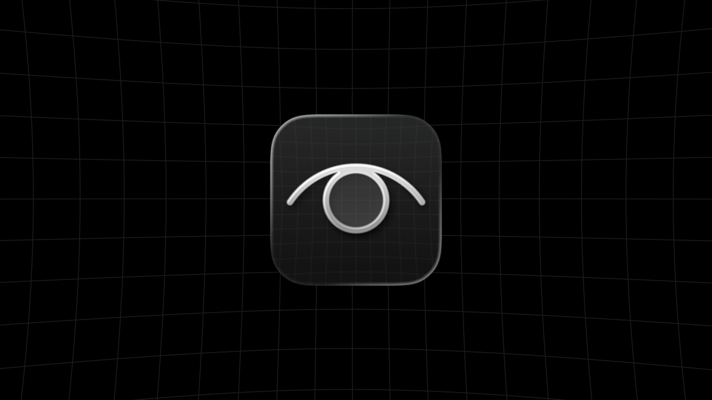

<p align="center">
  
</p>

# Óia → For your eyes only

Óia is a private visual library for your Mac. Save articles, images, videos, screenshots,
links, and quotes, then browse them on a board with search and tags.

Capture from the [browser extension](./extension), paste or drop straight into the app, or
share from your iPhone with the [Óia! Shortcut](./docs/ios-shortcut.md).

Everything lives in your own folder as Markdown files and local media. Your library works
offline and stays usable without the app. No accounts, servers, or telemetry. Sync the folder
however you like.

The name comes from **óia** (pronounced **OY-uh**), a colloquial Brazilian Portuguese way to say “look!”

## Build

Requires macOS 14+, Xcode 16+, [Rust](https://rustup.rs), Node.js/npm, and
[XcodeGen](https://github.com/yonaskolb/XcodeGen).

```bash
brew install xcodegen
rustup target add aarch64-apple-darwin x86_64-apple-darwin
(cd extension && npm install)
make build
open "macos/build/Build/Products/Debug/Óia.app"
```

Choose a library folder when the app opens. See [macOS](./macos), [extension](./extension),
and [core](./core) for setup details and extension installation.

## License & credits

Core, native host, and browser extension: MIT. macOS app: GPL-3.0-or-later.

Óia began as a fork of [ReadControl](https://github.com/readcontrol/root) by Rodrigo Boniatti.
Thanks for building it in the open.
