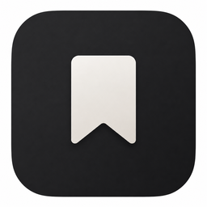

<p align="center">
  
</p>
<h1 align="center">Cuttings</h1>
<p align="center">
  Keep what you find, with where it came from.
</p>

---

# macos

The native SwiftUI client for **Cuttings**. Browse articles, images, videos, and quotes as a mixed
visual inspiration board, then search, tag, and revisit them. It embeds the Rust engine (`core`)
via UniFFI and watches the library folder for changes arriving through the user's own sync.

## Prerequisites

- macOS 14+ and Xcode 16+
- [xcodegen](https://github.com/yonaskolb/XcodeGen): `brew install xcodegen`
- [SwiftFormat](https://github.com/nicklockwood/SwiftFormat) + [SwiftLint](https://github.com/realm/SwiftLint)
  (`brew install swiftformat swiftlint`, or `mise install` to match the pinned versions)
- Rust targets for the XCFramework build: `rustup target add aarch64-apple-darwin x86_64-apple-darwin`

The Rust core lives at `../core` in this monorepo, and the `Makefile` references it there.

## Setup

Run once after cloning the monorepo (and again after updating `core`):

```bash
make all        # build the core XCFramework, copy bindings, generate Cuttings.xcodeproj
```

## Run

```bash
open Cuttings.xcodeproj                                    # then press Run in Xcode
xcodebuild build -project Cuttings.xcodeproj -scheme Cuttings   # or from the CLI
```

## Test

```bash
make test       # runs the unit suite (CuttingsTests) then the UI suite (CuttingsUITests)
```

- `CuttingsTests` — fast, hostless unit tests for pure app logic.
- `CuttingsUITests` — end-to-end XCUITest against a throwaway temp library.

Both are dependency-free (Xcode + the macOS SDK only). Run one suite or test while iterating:

```bash
xcodebuild test -project Cuttings.xcodeproj -scheme Cuttings -only-testing:CuttingsTests
```

## Format & lint

SwiftFormat rewrites code; SwiftLint checks it. SwiftFormat is configured to agree with
SwiftLint, so formatting won't introduce lint violations. Run in this order:

```bash
make format     # swiftformat . — rewrites sources in place
make lint       # swiftlint lint — reports remaining violations
```

## Software updates (Sparkle)

The project includes [Sparkle](https://sparkle-project.org), but update checks are deliberately
dormant until Cuttings has an official appcast URL and signing key. Before the first public release,
add `SUFeedURL` and `SUPublicEDKey` to `Sources/Cuttings/App/Info.plist`, start the updater, and add
`UpdateCommands` to `CuttingsApp`'s command group.

### Shipping a release

A public build must be **Developer ID signed, notarized, and stapled** — Gatekeeper and Sparkle
both reject an ad-hoc signature on a downloaded update. `make release` does the whole chain
(sign → notarize → staple → Sparkle-sign) and prints the appcast `edSignature` + `length`:

```bash
SIGN_IDENTITY="Developer ID Application: Your Name (TEAMID)" \
NOTARY_PROFILE=cuttings-notary \
make release
```

It needs a Developer ID Application certificate and a notarytool profile (created once with
`xcrun notarytool store-credentials`). Then upload the `.dmg` and add an `<item>` to the official
appcast once that feed exists.

`make dmg` is the ad-hoc, local-testing path only (not notarized).

## Make targets

```bash
make all           # build XCFramework + bindings + generate the Xcode project
make test          # run the test suites
make dmg           # ad-hoc-signed .dmg for local testing (not notarized)
make release       # Developer ID signed + notarized + stapled + Sparkle-signed .dmg
make format        # reformat with SwiftFormat
make lint          # lint with SwiftLint
make clean         # remove generated framework, bindings, and project
```

## Debugging

The embedded `core` logs every SQL statement to stderr when `SQL_TRACE=1` is set — see the
[core README](../core/README.md#debugging-sql-tracing).
